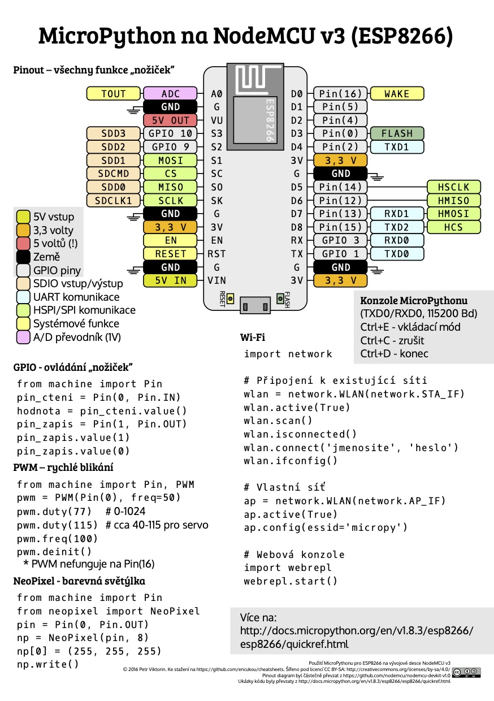

# Description
There is place for my own scripts for controlling `Nodemcu` device.

# Function Code

- [Publisher](https://github.com/vichi99/ESP8266/tree/master/publisher) Main script publishing by wifi measured data(DHT22) from Nodemcu via MicroPython to mqtt broker.

# Manuals

- [Flash MicroPython to ESP8266](Flash_MicroPython.md)
- [Deploy script/s to ESP8266(MicroPython)](Deploy_MicroPython_scripts.md)

# Other

- [Utils](https://github.com/vichi99/ESP8266/tree/master/utils) Partial parts of codes for controll, connecting, publishing and measuring with `Nodemcu`.

# License
- Code: [MIT](LICENSE)
