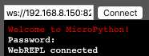

 # Set WebREPL to ESP8226
 - In addition to the serial line we can use for `put` and `get` file from `nodemcu` WebREPL, too.
 
 ## Usage
 
 - Connect to device prompt by [described here.](https://github.com/vichi99/ESP8266/blob/master/Deploy_MicroPython_scripts_ESP8266.md)
 - Type `import webrepl_setup`.
 You will see some like this.
 ```python
    >>> import webrepl_setup
    WebREPL daemon auto-start status: disabled

    Would you like to (E)nable or (D)isable it running on boot?
    (Empty line to quit)
    > E
    Would you like to change WebREPL password? (y/n) y
    New password (4-9 chars): xxxx
    Confirm password: xxxx
    Changes will be activated after reboot
    Would you like to reboot now? (y/n)
    > y

 ```
 
 - Now you have to set connect `nodemcu` to wifi. You can use this [wifi class.](https://github.com/vichi99/ESP8266/blob/master/utils/wifi.py)

 - Go to [http://micropython.org/webrepl/](http://micropython.org/webrepl/) and enter your `nodemcu` device ip address in the form `ws://192.168.1.1:8266/`. Change your ip address. Click to connect and if all is correct you will see enter for password.

 

 
 ### Inspiration
 For created this manual I was inspirated by this page [https://github.com/stlk/micropython/tree/master/workshop](https://github.com/stlk/micropython/tree/master/workshop)
 
 
