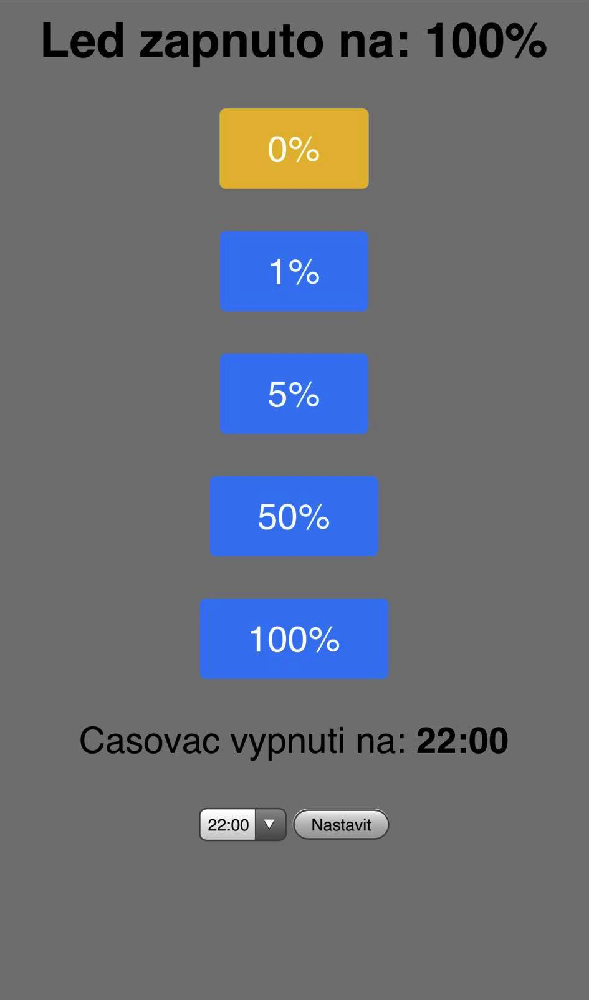

# Description
- Scripts for control led strips through wifi and button above bed.
- After successfully connect to wifi is running while loop for check btn press, timer off check and request input.
- Short btn press will cause switch to next level pwm duty.
- Long btn press will cause switch off.
- Gui is available in local network. For find ip address is necessarily conect to tty NodeMCU, scan newtwork or connect to router.
- Script operate with my [utils classes](https://github.com/vichi99/ESP8266/tree/master/utils) `wifi`.

# Installation

- Connecting with device and deploying scripts is described [here.](https://github.com/vichi99/ESP8266/blob/master/Deploy_MicroPython_scripts.md)

- For this application we need load this files to device. Utils are available [here.](https://github.com/vichi99/ESP8266/tree/master/utils)

- Make config file.

- Copy these files to nodemcu:

```sh
boot.py
main.py
config.json
wifi.py # from utils
```

# Usage

- Before runing scripts is important make `config.json` from `config.json.example` and fill it.

```python
# Timezone
"GMT": 2
# Wifi for connect
"WIFI_SSID": ""
"WIFI_PASSWORD": ""
```

# Constructions
- [instalation box](https://www.hadex.cz/o158a-instalacni-krabicka-b120-120x80x50mm/)
- [led strips](https://www.hadex.cz/k011a-100-led-pasek-10mm-bily-teply-60x-led5730m-ip20-civka-5m/) - uses only 2M
- [power supply 12V](https://www.hadex.cz/g721-napajec-sagemcom-xkd-2000ic120-24w-12v2a-konc55x21mm/)
- [step down](https://www.hadex.cz/m406-napajeci-modul-step-down-menic-3a-s-lm2596/)
- [NodeMCU](https://www.hadex.cz/m430e-modul-nodemcu-lua-wifi-esp8266-cp2102-vyvojovy-modul/)
- [button](https://www.hadex.cz/l228a-tlacitko-off-on-gq16f-10dm-250v3a-cervene-prosvetleni-12v/)
- [pwm regulator](https://www.hadex.cz/m369-vykonovy-spinac-mosfet-pwm-15a-400w-modul-xy-mos/)
- [conector 2 pin](https://www.hadex.cz/d575-gx12-konektor-2p-panelovy/)
- [socket 2 pin](https://www.hadex.cz/d576-gx12-zdirka-2p-na-kabel/)
- [conector 4 pin](https://www.hadex.cz/d575b-gx12-konektor-4p-panelovy/)
- [socket 4 pin](https://www.hadex.cz/d576b-gx12-zdirka-4p-na-kabel/)
    
## Screenshots


# GUI from mobile

