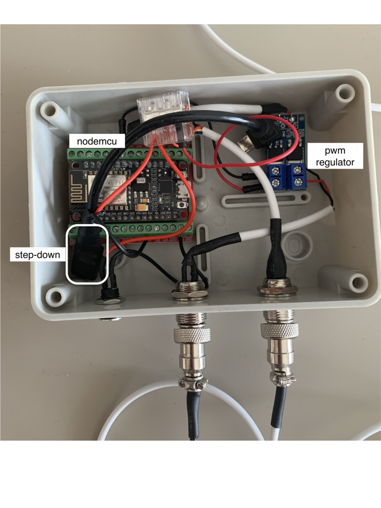
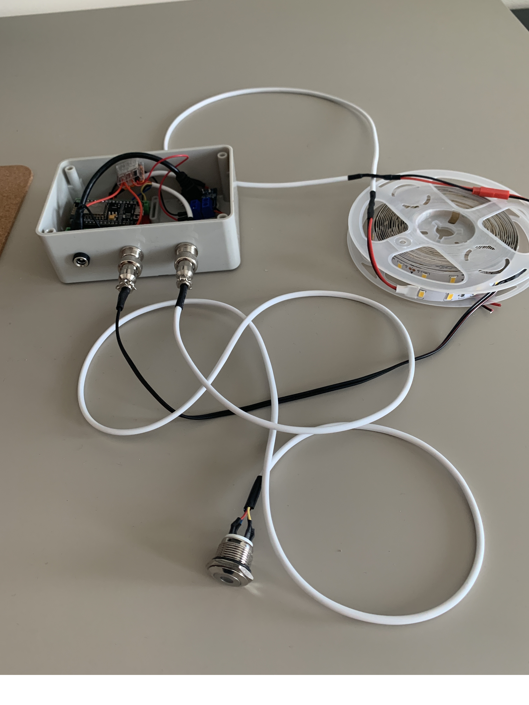

# LED BED
HW box for control led strips through mqtt broker and button above bed.
- There is 2 async loop:
  - First is connecting to internet and mqtt broker. Then will be subscribe topics changing values for led and timer off.
  - Second loop checking button press and timer off.
- Short btn press will cause switch to next level pwm duty.
- Long btn press will cause switch off.

# Installation

- Connecting with the device and deploying scripts is described [here.](https://github.com/vichi99/ESP8266/blob/master/Deploy_MicroPython_scripts.md)
    - Use `firmware-combined.bin` for flash nodemcu

- Make config file from `config.json.example` to `config.json`.

- Check constants at the `main.py`

- Copy these files to nodemcu:

```sh
main.py
config.json
```

# Issues
## #1
On my nodemcu I had problem with mqtt subscribing. The issue is described here [https://forum.micropython.org/viewtopic.php?t=4694](https://forum.micropython.org/viewtopic.php?t=4694)
- The solution is using `mqtt_as.py` from [https://github.com/peterhinch/micropython-mqtt/tree/master/mqtt_as](https://github.com/peterhinch/micropython-mqtt/tree/master/mqtt_as). However the file `mqtt_as.py` cannot by loaded directly to nodemcu. It has to be included into binaries which is flashed to nodemcu. Make binaries are described here [https://github.com/micropython/micropython/tree/master/ports/esp8266](https://github.com/micropython/micropython/tree/master/ports/esp8266)
- The result binaries file is [firmware-combined.bin](firmware-combined.bin)


# Constructions
- [installation box](https://www.hadex.cz/o158a-instalacni-krabicka-b120-120x80x50mm/)
- [led strips](https://www.hadex.cz/k011a-100-led-pasek-10mm-bily-teply-60x-led5730m-ip20-civka-5m/) - uses only 2M
- [power supply 12V](https://www.hadex.cz/g721-napajec-sagemcom-xkd-2000ic120-24w-12v2a-konc55x21mm/)
- [step down](https://www.hadex.cz/m406-napajeci-modul-step-down-menic-3a-s-lm2596/)
- [NodeMCU](https://www.hadex.cz/m430e-modul-nodemcu-lua-wifi-esp8266-cp2102-vyvojovy-modul/)
- [button](https://www.hadex.cz/l228a-tlacitko-off-on-gq16f-10dm-250v3a-cervene-prosvetleni-12v/)
- [pwm regulator](https://www.hadex.cz/m369-vykonovy-spinac-mosfet-pwm-15a-400w-modul-xy-mos/)
- [conector 2 pin](https://www.hadex.cz/d575-gx12-konektor-2p-panelovy/)
- [socket 2 pin](https://www.hadex.cz/d576-gx12-zdirka-2p-na-kabel/)
- [conector 4 pin](https://www.hadex.cz/d575b-gx12-konektor-4p-panelovy/)
- [socket 4 pin](https://www.hadex.cz/d576b-gx12-zdirka-4p-na-kabel/)
    
## Screenshots



